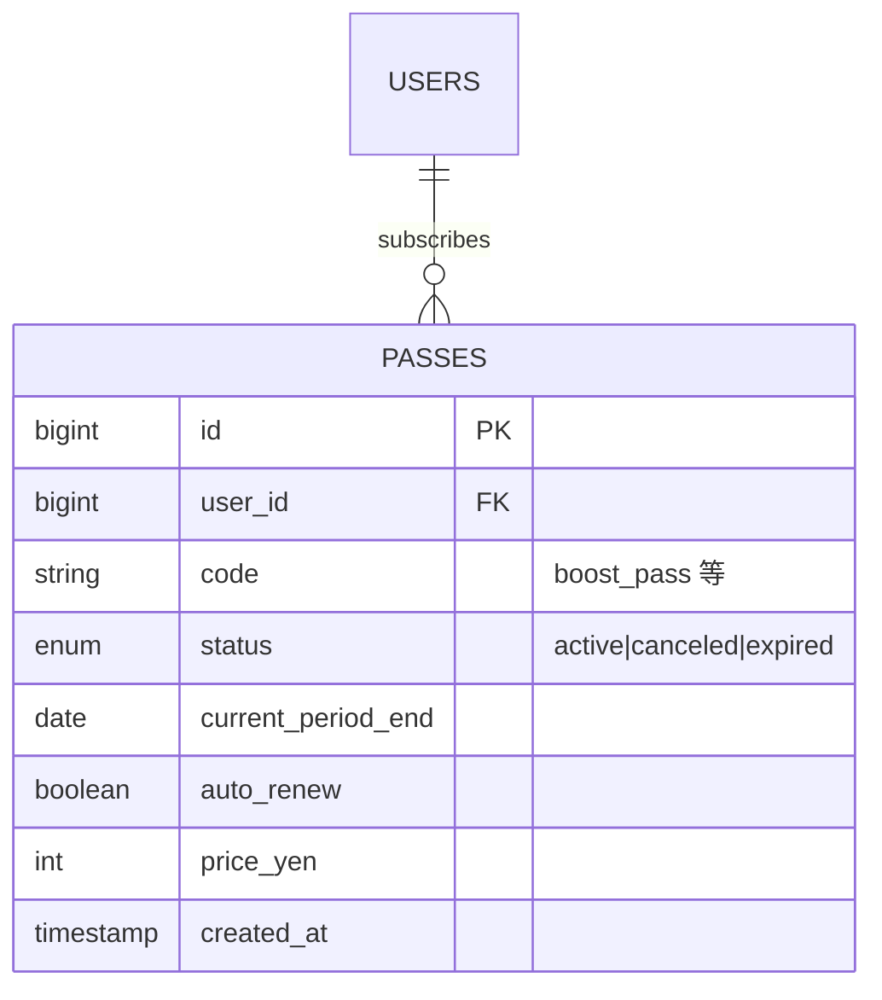

# ER図 / テーブル定義 — pato岡山（仮）

- 対象: MVP（patoコール先行）
- 記法: Mermaid `erDiagram`。金額は円ではなく**ポイント（整数）**で保持。

## 実装状況（マイグレーションとの対応）

**実装済み（`database/migrations/` に存在）**
`users` / `guest_profiles` / `cast_profiles` / `cast_screenings` / `identity_verifications` /
`areas` / `venues` / `class_tiers` / `area_class_prices` /
`point_wallets` / `point_products` / `point_transactions` /
`calls` / `call_line_items` / `call_participants` / `payouts` / `payout_items` /
`threads` / `thread_participants` / `messages` / `reviews` / `reports` / `sos_events` /
`cast_kpis` / `fan_points` / `badges` / `badge_grants` / `awards` / `rankings` /
`push_subscriptions` / `audit_logs`

**未実装（本ドキュメントに設計はあるがテーブル未作成。機能実装と同時に作る）**
`cast_tags`（詳細タグ検索）/ `coupons`・`coupon_grants`（クーポン）/ `gifts`（まとめてギフト）/
`passes`（定期購入パス）/ `referrals`（友達招待）

> 使わないテーブルを先に作ると死蔵するため、**機能実装とセットで追加する**方針。

---

## 1. ER図（Mermaid）

```mermaid
erDiagram
    USERS ||--o| GUEST_PROFILES : has
    USERS ||--o| CAST_PROFILES : has
    USERS ||--o| IDENTITY_VERIFICATIONS : verifies
    USERS ||--o| POINT_WALLETS : owns
    CAST_PROFILES ||--o{ CAST_SCREENINGS : undergoes
    CAST_PROFILES }o--|| CLASS_TIERS : ranked_as

    POINT_WALLETS ||--o{ POINT_TRANSACTIONS : ledger
    POINT_PRODUCTS ||--o{ POINT_TRANSACTIONS : purchased_via

    AREAS ||--o{ CALLS : located_in
    AREAS ||--o{ AREA_CLASS_PRICES : prices
    CLASS_TIERS ||--o{ AREA_CLASS_PRICES : priced_by
    VENUES }o--|| AREAS : in
    USERS ||--o{ CALLS : "creates (guest)"
    CALLS }o--o| VENUES : at
    CALLS ||--o{ CALL_LINE_ITEMS : "requests (class×headcount)"
    CALL_LINE_ITEMS }o--|| CLASS_TIERS : of
    CALLS ||--o{ CALL_PARTICIPANTS : has
    CAST_PROFILES ||--o{ CALL_PARTICIPANTS : "joins (cast)"

    CALLS ||--o{ POINT_TRANSACTIONS : "holds/captures"
    CALL_PARTICIPANTS ||--o{ PAYOUT_ITEMS : accrues
    POINT_WALLETS ||--o{ PAYOUTS : "cast wallet"
    PAYOUTS ||--o{ PAYOUT_ITEMS : groups

    CALLS ||--o| THREADS : has
    THREADS ||--o{ THREAD_PARTICIPANTS : includes
    USERS ||--o{ THREAD_PARTICIPANTS : joins
    THREADS ||--o{ MESSAGES : contains
    USERS ||--o{ MESSAGES : sends

    CALLS ||--o{ REVIEWS : about
    USERS ||--o{ REVIEWS : "writes/receives"
    USERS ||--o{ REPORTS : "reporter/target"

    USERS {
      bigint id PK
      string email UK
      string phone UK
      string password_hash
      enum role "guest|cast|admin|system"
      enum status "active|suspended|withdrawn"
      timestamp created_at
    }

    GUEST_PROFILES {
      bigint id PK
      bigint user_id FK
      string display_name
      string avatar_path
    }

    CAST_PROFILES {
      bigint id PK
      bigint user_id FK
      string display_name
      bigint class_tier_id FK
      enum screening_status "applied|photo_review|interview|approved|rejected"
      boolean is_active
      enum availability "now|today|offline"
      boolean in_session "合流中(対応中)"
      string bio "一言"
      int age
      bigint home_area_id FK
    }

    CAST_SCREENINGS {
      bigint id PK
      bigint cast_profile_id FK
      enum stage "photo|interview"
      enum result "pending|passed|failed"
      bigint reviewed_by FK "admin user"
      text note
      timestamp reviewed_at
    }

    CLASS_TIERS {
      bigint id PK
      string code "premium|vip|royal_vip"
      string name
      int night_surcharge_bp "深夜加算(千分率など)"
    }

    AREA_CLASS_PRICES {
      bigint id PK
      bigint area_id FK
      bigint class_tier_id FK
      int points_per_30min "エリア×クラスの基本料金(ゲスト)"
      int take_rate_bp "運営取り分(千分率) 既定4000=40%"
      int nomination_surcharge_bp "指名加算 既定2000"
      int night_surcharge_bp "深夜加算 既定2000"
      date effective_from
    }

    IDENTITY_VERIFICATIONS {
      bigint id PK
      bigint user_id FK
      enum method "ekyc"
      enum status "pending|verified|rejected"
      text birthdate_encrypted "PII: 暗号化"
      boolean is_adult "18歳以上"
      string provider_ref
      timestamp verified_at
    }

    POINT_WALLETS {
      bigint id PK
      bigint user_id FK
      timestamp created_at
    }

    POINT_PRODUCTS {
      bigint id PK
      int paid_points
      int price_yen
      boolean active
    }

    POINT_TRANSACTIONS {
      bigint id PK
      bigint wallet_id FK
      enum type "purchase|hold|capture|release|expire|tip|payout_debit|grant"
      enum kind "paid|free"
      int points "正の絶対量。符号は type が決める"
      bigint call_id FK "nullable"
      bigint product_id FK "nullable"
      date expires_on "nullable(付与から180日)"
      string idempotency_key UK
      timestamp created_at
    }

    AREAS {
      bigint id PK
      string name "岡山市中心部など"
      boolean serviceable
    }

    VENUES {
      bigint id PK
      bigint area_id FK
      string name
      string address
    }

    CALLS {
      bigint id PK
      bigint guest_user_id FK
      bigint area_id FK
      bigint venue_id FK "nullable"
      datetime start_at
      int duration_min "30単位(延長で増える)"
      int headcount "募集人数"
      int hold_points "与信ポイント(延長で増える)"
      int cast_payout_points "作成時に確定させる報酬総額"
      boolean is_night "深夜加算対象"
      enum venue_kind "restaurant|bar|public (密室禁止)"
      enum status "draft|open|matched|in_progress|completed|canceled|expired"
      boolean is_mix "クラス混在許可"
      bigint nominated_cast_profile_id FK "nullable(優先マッチング/指名)"
      int priority_surcharge_points "指名追加分"
      text note
      timestamp created_at
    }

    CALL_LINE_ITEMS {
      bigint id PK
      bigint call_id FK
      bigint class_tier_id FK
      int headcount "このクラスの募集人数"
      boolean nominated "指名(優先マッチング)か"
    }

    CALL_PARTICIPANTS {
      bigint id PK
      bigint call_id FK
      bigint cast_profile_id FK
      enum status "applied|accepted|joined|completed|no_show|canceled"
      int tip_points "おひねり配分"
      timestamp joined_at
    }

    PAYOUTS {
      bigint id PK
      bigint cast_wallet_id FK
      int amount_points
      enum status "accrued|requested|approved|paid|rejected"
      timestamp requested_at
      timestamp paid_at
    }

    PAYOUT_ITEMS {
      bigint id PK
      bigint payout_id FK "nullable(未申請はnull)"
      bigint call_participant_id FK
      int amount_points
    }

    THREADS {
      bigint id PK
      bigint call_id FK "nullable(コンシェルジュ/個別スレッド)"
      enum kind "call|direct|concierge"
      timestamp last_message_at
      timestamp created_at
    }

    THREAD_PARTICIPANTS {
      bigint id PK
      bigint thread_id FK
      bigint user_id FK
      boolean is_favorite "参加者ごとに持つ"
      boolean is_hidden
      timestamp last_read_at
    }

    MESSAGES {
      bigint id PK
      bigint thread_id FK
      bigint sender_user_id FK
      text body
      boolean flagged "NG検知"
      json flag_reasons "検知した理由コード"
      timestamp created_at
    }

    REVIEWS {
      bigint id PK
      bigint call_id FK
      bigint rater_user_id FK
      bigint ratee_user_id FK
      int stars "1-5"
      json tags
      text comment
      timestamp created_at
    }

    REPORTS {
      bigint id PK
      bigint reporter_user_id FK
      bigint target_user_id FK
      bigint call_id FK "nullable"
      enum reason "harassment|external_solicit|danger|other"
      enum status "open|reviewing|actioned|dismissed"
      text detail
      timestamp created_at
    }
```

---

## 2. 設計上の要点

- **ポイントは台帳（POINT_TRANSACTIONS）で表現**。残高テーブルは持たず、
  `signed_points` の合算で残高を出す。`idempotency_key` で二重計上を防ぐ。
- **有償/無償の区別**は `kind`。消費時は無償を優先して減らす（アプリ側ロジック）。
- **有効期限**は付与系トランザクションの `expires_on`。日次バッチで `expire` を計上。
- **与信（hold）→ 確定（capture）/ 解放（release）** を type で表現。利用可能残高は
  `purchase/grant/release - hold(未captureぶん) - capture - tip - expire` で算出。
- **精算**は CALL_PARTICIPANTS → PAYOUT_ITEMS → PAYOUTS の三段。報酬レート（テイクレート）は
  未確定なので、算出は Service に閉じ込め、料率はマスタ化して差し替え可能にする。
- **エリア限定**は AREAS.serviceable と CALLS.area_id で制御（岡山のみ true）。
- **年齢確認**は IDENTITY_VERIFICATIONS.is_adult。false/未確認は呼び出し作成・参加不可。
- PII（生年月日・provider_ref 等）は暗号化保存し、ログ出力しない。

---

## 3. 料金・課金の補足

- **料金はエリア×クラス**で `AREA_CLASS_PRICES` に持つ（pato も地方ほど安い）。呼び出し作成時の
  ホールド額はこのマスタ×時間×人数（＋指名/深夜加算）で算出。岡山は「地方」水準で seed。
- **指名/優先マッチング**は `CALLS.nominated_cast_profile_id` ＋ `priority_surcharge_points`。
- **ミックス**は `CALLS.is_mix`。成立した参加者の実クラスで確定計算。
- **課金モード**（自動/事前）と**サブスク（パス）**は下記 `PASSES` / ポイント台帳で表現。

## 3b. 探索・ゲーミフィケーション（実アプリ準拠 / 段階導入）

```mermaid
erDiagram
    CAST_PROFILES ||--o{ CAST_TAGS : tagged
    CAST_PROFILES ||--|| CAST_KPIS : summarized
    CAST_PROFILES ||--o{ FAN_POINTS : earns
    CAST_PROFILES ||--o{ BADGE_GRANTS : receives
    USERS ||--o{ BADGE_GRANTS : "sends (guest)"
    BADGES ||--o{ BADGE_GRANTS : type
    CAST_PROFILES ||--o{ AWARDS : titled
    USERS ||--o{ COUPON_GRANTS : holds
    COUPONS ||--o{ COUPON_GRANTS : issued
    USERS ||--o{ REFERRALS : "inviter/invitee"
    RANKINGS }o--|| AREAS : scoped

    CAST_TAGS {
      bigint id PK
      bigint cast_profile_id FK
      string category "style|face|type|hair|career|play|skill"
      string value
    }
    CAST_KPIS {
      bigint id PK
      bigint cast_profile_id FK
      decimal extend_rate "延長率"
      decimal repeat_rate "サービスリピート率"
      decimal remeet_rate "また会いたい率"
      int fan_points_total
      timestamp recalculated_at
    }
    FAN_POINTS {
      bigint id PK
      bigint cast_profile_id FK
      bigint call_id FK "nullable"
      int points
      string reason
      timestamp created_at
    }
    BADGES {
      bigint id PK
      string code "healing|sparkle|humor|diva ..."
      string name
    }
    BADGE_GRANTS {
      bigint id PK
      bigint badge_id FK
      bigint from_user_id FK "guest"
      bigint cast_profile_id FK
      bigint call_id FK "nullable"
      timestamp created_at
    }
    AWARDS {
      bigint id PK
      bigint cast_profile_id FK
      string event_code "cinderella_race|tenka ..."
      string title "合流時間部門Sランク 等"
      string season "2025 等"
    }
    COUPONS {
      bigint id PK
      string code
      enum type "discount|bonus_points"
      int value
      date valid_until
    }
    COUPON_GRANTS {
      bigint id PK
      bigint coupon_id FK
      bigint user_id FK
      enum status "granted|used|expired"
      bigint call_id FK "nullable"
    }
    REFERRALS {
      bigint id PK
      bigint inviter_user_id FK
      bigint invitee_user_id FK "nullable(未成立)"
      string invite_code
      enum status "sent|registered|rewarded"
    }
    GIFTS {
      bigint id PK
      bigint from_user_id FK "guest"
      bigint cast_profile_id FK
      string gift_code "称賛/ポイントギフト種別"
      int points "ポイントギフトの場合"
      boolean is_batch "まとめてギフトの一部"
      timestamp created_at
    }
    RANKINGS {
      bigint id PK
      enum subject "guest|cast"
      enum period "yesterday|last_week|last_month|this_month|half|year|all"
      bigint area_id FK "nullable(全国)"
      string category "総合 等"
      bigint ref_id "user_id or cast_profile_id"
      int rank
      int score
      date computed_on
    }
```

- ランキングは集計結果テーブル（日次バッチで算出）。リアルタイムは Redis で補助。
- ファンポイント/KPI はレビュー・延長・リピート等のイベントから再計算（Job）。
- MVPは CAST_KPIS の表示から。ランキング/称号/大会は供給が育ってから段階導入。

## 4. 次フェーズで追加予定

- コパト用 `copato_bookings`（1対1・日程調整）／`tsubuyaki`（つぶやき）
- お気に入り `favorites`（ファミリー）／ブロック `blocks`
- 通知 `notifications`（配信履歴）
- おひねりの独立テーブル化（現状は participant.tip_points に集約）
