# ER図 / テーブル定義 — pato岡山（仮）

- 対象: MVP（patoコール先行）
- 記法: Mermaid `erDiagram`。金額は円ではなく**ポイント（整数）**で保持。

---

## 1. ER図（Mermaid）

```mermaid
erDiagram
    USERS ||--o| GUEST_PROFILES : has
    USERS ||--o| CAST_PROFILES : has
    USERS ||--o| IDENTITY_VERIFICATIONS : verifies
    USERS ||--o| POINT_WALLETS : owns
    CAST_PROFILES ||--o{ CAST_SCREENINGS : undergoes
    CAST_PROFILES }o--|| CLASS_TIERS : ranked_as

    POINT_WALLETS ||--o{ POINT_TRANSACTIONS : ledger
    POINT_PRODUCTS ||--o{ POINT_TRANSACTIONS : purchased_via

    AREAS ||--o{ CALLS : located_in
    VENUES }o--|| AREAS : in
    USERS ||--o{ CALLS : "creates (guest)"
    CALLS }o--o| VENUES : at
    CALLS }o--|| CLASS_TIERS : requested_class
    CALLS ||--o{ CALL_PARTICIPANTS : has
    CAST_PROFILES ||--o{ CALL_PARTICIPANTS : "joins (cast)"

    CALLS ||--o{ POINT_TRANSACTIONS : "holds/captures"
    CALL_PARTICIPANTS ||--o{ PAYOUT_ITEMS : accrues
    POINT_WALLETS ||--o{ PAYOUTS : "cast wallet"
    PAYOUTS ||--o{ PAYOUT_ITEMS : groups

    CALLS ||--o| THREADS : has
    THREADS ||--o{ MESSAGES : contains
    USERS ||--o{ MESSAGES : sends

    CALLS ||--o{ REVIEWS : about
    USERS ||--o{ REVIEWS : "writes/receives"
    USERS ||--o{ REPORTS : "reporter/target"

    USERS {
      bigint id PK
      string email UK
      string phone UK
      string password_hash
      enum role "guest|cast|admin"
      enum status "active|suspended|withdrawn"
      timestamp created_at
    }

    GUEST_PROFILES {
      bigint id PK
      bigint user_id FK
      string display_name
      string avatar_path
    }

    CAST_PROFILES {
      bigint id PK
      bigint user_id FK
      string display_name
      bigint class_tier_id FK
      enum screening_status "applied|photo_review|interview|approved|rejected"
      boolean is_active
    }

    CAST_SCREENINGS {
      bigint id PK
      bigint cast_profile_id FK
      enum stage "photo|interview"
      enum result "pending|passed|failed"
      bigint reviewed_by FK "admin user"
      text note
      timestamp reviewed_at
    }

    CLASS_TIERS {
      bigint id PK
      string code "standard|premium|vip"
      string name
      int base_points_per_30min
      int night_surcharge_bp "深夜加算(千分率など)"
    }

    IDENTITY_VERIFICATIONS {
      bigint id PK
      bigint user_id FK
      enum method "ekyc"
      enum status "pending|verified|rejected"
      date birthdate
      boolean is_adult "18歳以上"
      string provider_ref
      timestamp verified_at
    }

    POINT_WALLETS {
      bigint id PK
      bigint user_id FK
      timestamp created_at
    }

    POINT_PRODUCTS {
      bigint id PK
      int paid_points
      int price_yen
      boolean active
    }

    POINT_TRANSACTIONS {
      bigint id PK
      bigint wallet_id FK
      enum type "purchase|hold|capture|release|expire|tip|payout_debit|grant"
      enum kind "paid|free"
      int signed_points "符号付き。残高は合算"
      bigint call_id FK "nullable"
      bigint product_id FK "nullable"
      date expires_on "nullable(付与から180日)"
      string idempotency_key UK
      timestamp created_at
    }

    AREAS {
      bigint id PK
      string name "岡山市中心部など"
      boolean serviceable
    }

    VENUES {
      bigint id PK
      bigint area_id FK
      string name
      string address
    }

    CALLS {
      bigint id PK
      bigint guest_user_id FK
      bigint area_id FK
      bigint venue_id FK "nullable"
      bigint class_tier_id FK
      datetime start_at
      int duration_min "30単位"
      int headcount "募集人数"
      int hold_points "与信ポイント"
      enum status "draft|open|matched|in_progress|completed|canceled|expired"
      text note
      timestamp created_at
    }

    CALL_PARTICIPANTS {
      bigint id PK
      bigint call_id FK
      bigint cast_profile_id FK
      enum status "applied|accepted|joined|completed|no_show|canceled"
      int tip_points "おひねり配分"
      timestamp joined_at
    }

    PAYOUTS {
      bigint id PK
      bigint cast_wallet_id FK
      int amount_points
      enum status "accrued|requested|approved|paid|rejected"
      timestamp requested_at
      timestamp paid_at
    }

    PAYOUT_ITEMS {
      bigint id PK
      bigint payout_id FK "nullable(未申請はnull)"
      bigint call_participant_id FK
      int amount_points
    }

    THREADS {
      bigint id PK
      bigint call_id FK
      timestamp created_at
    }

    MESSAGES {
      bigint id PK
      bigint thread_id FK
      bigint sender_user_id FK
      text body
      boolean flagged "NG検知"
      timestamp created_at
    }

    REVIEWS {
      bigint id PK
      bigint call_id FK
      bigint rater_user_id FK
      bigint ratee_user_id FK
      int stars "1-5"
      json tags
      text comment
      timestamp created_at
    }

    REPORTS {
      bigint id PK
      bigint reporter_user_id FK
      bigint target_user_id FK
      bigint call_id FK "nullable"
      enum reason "harassment|external_solicit|danger|other"
      enum status "open|reviewing|actioned|dismissed"
      text detail
      timestamp created_at
    }
```

---

## 2. 設計上の要点

- **ポイントは台帳（POINT_TRANSACTIONS）で表現**。残高テーブルは持たず、
  `signed_points` の合算で残高を出す。`idempotency_key` で二重計上を防ぐ。
- **有償/無償の区別**は `kind`。消費時は無償を優先して減らす（アプリ側ロジック）。
- **有効期限**は付与系トランザクションの `expires_on`。日次バッチで `expire` を計上。
- **与信（hold）→ 確定（capture）/ 解放（release）** を type で表現。利用可能残高は
  `purchase/grant/release - hold(未captureぶん) - capture - tip - expire` で算出。
- **精算**は CALL_PARTICIPANTS → PAYOUT_ITEMS → PAYOUTS の三段。報酬レート（テイクレート）は
  未確定なので、算出は Service に閉じ込め、料率はマスタ化して差し替え可能にする。
- **エリア限定**は AREAS.serviceable と CALLS.area_id で制御（岡山のみ true）。
- **年齢確認**は IDENTITY_VERIFICATIONS.is_adult。false/未確認は呼び出し作成・参加不可。
- PII（生年月日・provider_ref 等）は暗号化保存し、ログ出力しない。

---

## 3. 次フェーズで追加予定

- コパト用 `copato_bookings`（1対1・日程調整）
- ブロック `blocks`
- 通知 `notifications`（配信履歴）
- おひねりの独立テーブル化（現状は participant.tip_points に集約）
